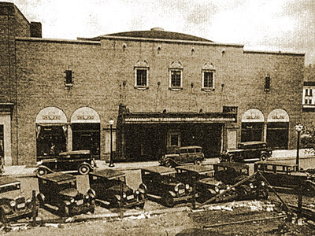

## Restoration
The Bluefield Preservation Society work to restore and revitalize distressed historic and cultural resources in the Bluefield area through education and public awareness. Because each project poses unique challenges, we work toward creative solutions tailored to the specific issues at hand, often leading to collaboration with partners in the community. When a restoration project reaches a successful outcome, it is rolled off the list, and a new at-risk resource is added.

<h3>Current Projects</h3>
    

        

<h4 class="project-title">Granada Theater</h4>

        

        

The Bluefield Preservation Society is working to restore the Granada Theater located on Commerce Drive in downtown Bluefield, WV. It is our plan to rehabilitate the building for cinema, stage productions, concerts, and more— improving the quality of living for our community and preserving our rich history. Our renovation plans have recently been approved by the WV Division of Culture and History as well as the US Department of the Interior for meeting the standards of historical preservation.

<a class="button-donate custom-dbox-popup" href="https://donorbox.org/granada-theater-restoration">Donate</a>

        

    

